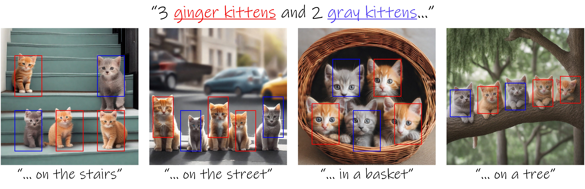

# Testing Bounded Attention for my master thesis

<div align="center">
<h1>Be Yourself: Bounded Attention for Multi-Subject Text-to-Image Generation (ECCV 2024)</h1>

[[Omer Dahary]()], [[Or Patashnik]()], [[Kfir Aberman]()], [[Daniel Cohen-Or]()]

<a href="https://omer11a.github.io/bounded-attention/"></a>
<a href="https://arxiv.org/abs/2403.16990"></a>
[](https://huggingface.co/spaces/omer11a/bounded-attention)

<p align="center">

</p>

<h3>Abstract</h3>

Text-to-image diffusion models have an unprecedented ability to generate diverse and high-quality images. However, they often struggle to faithfully capture the intended semantics of complex input prompts that include multiple subjects. Recently, numerous layout-to-image extensions have been introduced to improve user control, aiming to localize subjects represented by specific tokens. Yet, these methods often produce semantically inaccurate images, especially when dealing with multiple semantically or visually similar subjects. In this work, we study and analyze the causes of these limitations. Our exploration reveals that the primary issue stems from inadvertent semantic leakage between subjects in the denoising process. This leakage is attributed to the diffusion model’s attention layers, which tend to blend the visual features of different subjects. To address these issues, we introduce Bounded Attention, a training-free method for bounding the information flow in the sampling process. Bounded Attention prevents detrimental leakage among subjects and enables guiding the generation to promote each subject's individuality, even with complex multi-subject conditioning. Through extensive experimentation, we demonstrate that our method empowers the generation of multiple subjects that better align with given prompts and layouts.

</div>

## Quick start

```
conda create --name bounded-attention python=3.11.4
conda activate bounded-attention
pip install -r requirements.txt
```

Then, run in Python:

```
import nltk
nltk.download('averaged_perceptron_tagger')
```

## Images generation

The .csv file containing the prompts should be inside a folder named `prompts` that is posiotioned in the root of the project.

Each row in the CSV defines a single generation sample and includes:

- a full prompt (used as global context),
- up to 4 objects with corresponding bounding boxes, local phrases and their tokens.

The expected column format is:
`id,prompt,obj1,bbox1,token1,obj2,bbox2,token2,obj3,bbox3,token3,obj4,bbox4,token4`

To run the image generation from that prompt list with the standard SD, use the following command:

```bash
python run_sd.py
```

To run the image generation from that prompt list with SD XL version, use the following command:

```bash
python run_xl.py
```

## Acknowledgements

This code was built using the code from the following repositories:

- [diffusers](https://github.com/huggingface/diffusers)
- [Prompt-to-Prompt](https://github.com/google/prompt-to-prompt/)
- [MasaCtrl](https://github.com/TencentARC/MasaCtrl)

## Citation

```
@misc{dahary2024yourself,
    title={Be Yourself: Bounded Attention for Multi-Subject Text-to-Image Generation},
    author={Omer Dahary and Or Patashnik and Kfir Aberman and Daniel Cohen-Or},
    year={2024},
    eprint={2403.16990},
    archivePrefix={arXiv},
    primaryClass={cs.CV}
 }
```
